# VolunteerHub UML Diagrams

## 1. System Architecture Diagram

## 2. Database Entity Relationship Diagram

## 3. Class Diagram

## 4. Use Case Diagram

## 5. Sequence Diagram - User Registration

## 6. Sequence Diagram - Event Registration

## 7. Activity Diagram - Event Creation Process

## 8. State Diagram - Event Lifecycle

## 9. Component Diagram

## 10. Deployment Diagram

```mermaid
graph TB
    subgraph "Client Devices"
        A[Desktop Browser]
        B[Mobile Browser]
        C[Tablet Browser]
    end
    
    subgraph "Web Server (Apache)"
        D[Static Files]
        E[PHP Runtime]
        F[SSL Certificate]
    end
    
    subgraph "Application Server"
        G[VolunteerHub App]
        H[API Endpoints]
        I[Authentication Service]
    end
    
    subgraph "Database Server"
        J[(MySQL Database)]
        K[Backup Storage]
    end
    
    subgraph "External Services"
        L[Google OAuth API]
        M[Email SMTP Server]
        N[Tawk.to Chat Service]
    end
    
    A --> F
    B --> F
    C --> F
    F --> D
    F --> E
    E --> G
    G --> H
    G --> I
    H --> J
    I --> J
    J --> K
    I --> L
    G --> M
    D --> N
```

## Diagram Descriptions

### 1. System Architecture
Shows the overall system structure with client, presentation, application, and data layers, including external service integrations.

### 2. Database ERD
Illustrates the database schema with all tables, relationships, and key constraints for the VolunteerHub system.

### 3. Class Diagram
Represents the object-oriented structure of the system with main classes, their attributes, methods, and relationships.

### 4. Use Case Diagram
Depicts the functional requirements showing what different types of users can do in the system.

### 5. Registration Sequence
Shows the step-by-step process of user registration including validation, database operations, and response handling.

### 6. Event Registration Sequence
Illustrates the volunteer event registration process with authentication checks and database updates.

### 7. Event Creation Activity
Demonstrates the workflow for organizers creating new events with validation and error handling.

### 8. Event State Diagram
Shows the different states an event can be in throughout its lifecycle from creation to archival.

### 9. Component Diagram
Displays the system's modular structure showing how different components interact with each other.

### 10. Deployment Diagram
Illustrates the physical deployment of the system components across different servers and services.

## Usage Notes

These UML diagrams provide a comprehensive view of the VolunteerHub system architecture, data model, and user interactions. They can be used for:

- **System Documentation**: Understanding the overall system structure
- **Development Planning**: Guiding implementation decisions
- **Maintenance**: Helping with system updates and modifications
- **Training**: Onboarding new developers to the project
- **Communication**: Explaining the system to stakeholders

The diagrams are created using Mermaid syntax and can be rendered in most modern documentation platforms, including GitHub, GitLab, and various wiki systems.